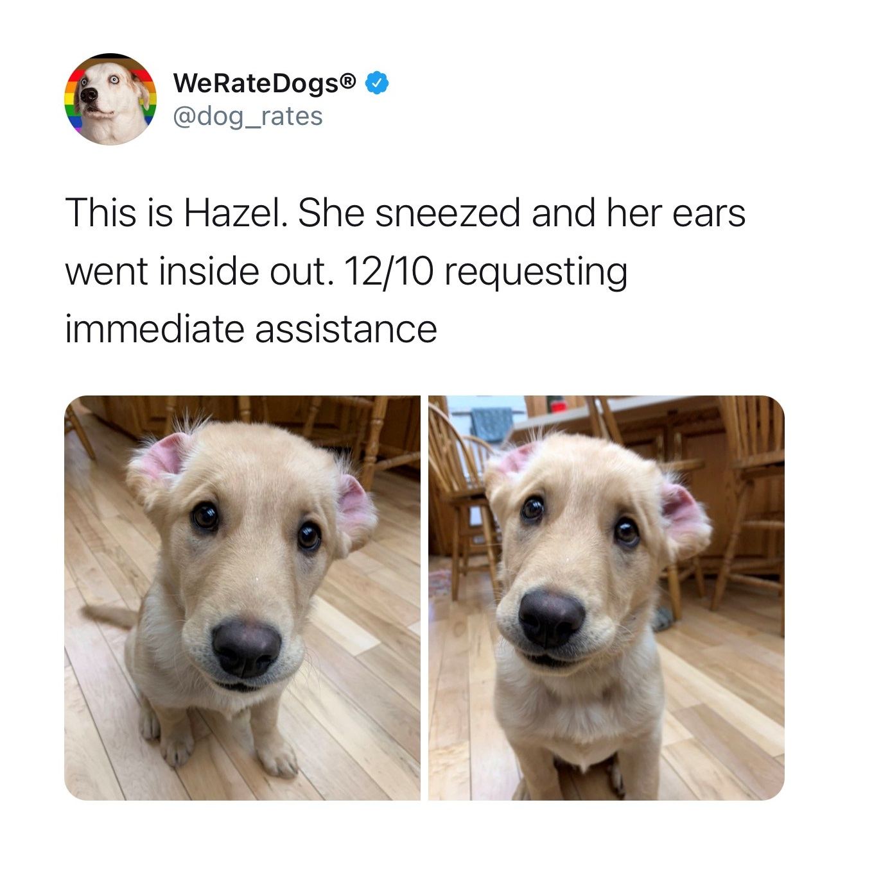
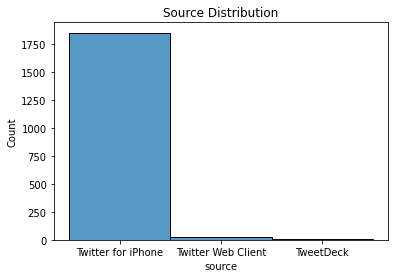

# We-Rate-Dogs---Data-Wrangling

## INTRODUCTION

Real-world data seldom comes clean. Using Python and its libraries, we will gather data from a variety of sources and in a variety of formats, assess its quality(worthiness) and tidiness(structural issues), then clean it into desired format before performing any further analysis on them. This is called data wrangling. 

I'll make sure to document my wrangling efforts in a Jupyter Notebook as I proceed in my workigs, plus showcase them through analyses and visualizations using Python (and its libraries) and/or SQL.

The dataset that I will be wrangling (and analyzing and visualizing) is the tweet archive of Twitter user `@dog_rates`, also known as `WeRateDogs`. `WeRateDogs` is a Twitter account that rates people's dogs with a humorous comment about the dog. These ratings almost always have a denominator of 10. The numerators, though? Almost always greater than 10. 11/10, 12/10, 13/10, etc. Why? Because "they're good dogs Brent." `WeRateDogs` has over 4 million followers and has received international media coverage.

_Lets Get Started_

## AIM
The goal of this project is to successfully wrangle data related to dog ratings. The data is sourced from the twitter user `@WeRateDogs`. Once we have effectively gathered, assessed, and cleaned our data in this project, it can be used for futher analysis.

## GATHERING
Here, I'd be gather three(3) pieces of data as stated below:

1. The `WeRateDogs` Twitter archive: [link](https://d17h27t6h515a5.cloudfront.net/topher/2017/August/59a4e958_twitter-archive-enhanced/twitter-archive-enhanced.csv)

2. The tweet image predictions by three diffrent image classification models: [link](https://d17h27t6h515a5.cloudfront.net/topher/2017/August/599fd2ad_image-predictions/image-predictions.tsv)

3. Each tweet's retweet count and favorite count. Using the tweet IDs in the `WeRateDogs` Twitter archive, we will query the Twitter API for each tweet's JSON data using Python's `Tweepy` library and store in `tweet_json.txt file`(JSON format).

## ASSESSING

After gathering all three pieces of data, assess them visually and programmatically for quality and tidiness issues. Detect and document at least eight (8) quality issues and two (2) tidiness issues in the "Accessing Data" section.

I'll be using two types of assessment in this project:

**Visual assessment**: each piece of gathered data is displayed in the Jupyter Notebook for visual assessment purposes. Once displayed, data can additionally be assessed in an external application (e.g. Excel, text editor).

**Programmatic assessment**: pandas functions and/or methods are used to assess the data.

Having successfully accessed the datasets, both visually and programmatically. 
Below I have stated the most obvious and visible issues found the datasets, with respect to quality and tidiness.

**Quality:** Issues with the content. Low quality data is also known as dirty data.

**Tidiness:** Issues with the structure that prevent easy analysis. Untidy data is also known as messy data. 

Tidy data requirements:

- Each variable forms a column.

- Each observation forms a row.

- Each type of observational unit forms a table.

## Quality
- Data types issues: 1.`timestamp & retweeted_status_timestamp column need be splited into two(date and time)`; 2. `dog_stage column should be categorical`; 3. `tweet_id, in_reply_to_status_id, in_reply_to_user_id, retweeted_status_id, retweeted_status_user_id columns(should be str)`
- Remove columns with high frequency of missing values that can't be resolved - retweeted_status_id, retweeted_status_user_id, retweeted_status_timestamp, expanded_urls, in_reply_to_status_id, in_reply_to_user_id
- source column values are not human readable and should be edited(Change source column from ulr type to text)
- name, doggo, floofer, pupper and puppo columns are mostly `None`, melting them into one column would ease
- Convert non-dog names(`such`, `quite`, `a`, `an`) to 'None' then make title case.
- The rating_numerator and rating_denominator values are off in many instances.
- There are some tweets which are retweets to @dog_rates which is the twitter handle for We Rate Dogs
- naming convection uses `_` instead of `tab` in p1, p2 and p3 column values. 
- mixturue of upper and lower in p1, p2 and p3 columns values.
- make column names descriptive enough
- There are image predictions predictions present for duplicate `jpg_url` with different tweet ids.
- tweet id column.name is not inconsistence, `id` here `tweet_id` in others.
- Both `retweet_count` and `favorite_count` values are duplicated in some rows

## Tidiness
- melt doggo, floofer, pupper, puppo columns into one column(`dog stage`) 
- Merge dataframe - `tweet_archive` and `tweet_react`

## CLEANING
Cleaning your data is the third step in data wrangling. It is where we have fixed the quality and tidiness issues that we identified in the assess step. Here, we have resolved all of the issues mentioned above, one at a time

### Format
- Missing Data
- Tidiness Issues
- Other Quality Issues

### steps:
- Define: We converted our assessments into defined cleaning tasks. These definitions also serve as an instruction list so others (or we in the future) can look at our work and reproduce it.
- Code: We converted those definitions to code and ran that code.
- Test: We tested our dataset, visually or with code, to make sure our cleaning operations worked.

## Cleaning Actions Implemented

- **Remove columns with high frequency of missing values that can't be resolved - retweeted_status_id, retweeted_status_user_id, retweeted_status_timestamp, expanded_urls, in_reply_to_status_id, in_reply_to_user_id**

> _**Define** : Remove the unnecessary columns `in_reply_to_status_id`, `in_reply_to_user_id`, `retweeted_status_timestamp` and `retweeted_status_user_id`; fill the missing values of `expanded_urls` column in `tweet_clean` table_

- **tweet id column.name is not inconsistence, id here tweet_id in others.**

> _**Define** : Rename the `id` column in `tweet_count_clean` to `tweet_id`_

- **melt doggo, floofer, pupper, puppo columns into one column(dog stage)**

>_**Define** : Combine the `doggo`, `floofer`, `pupper`, `puppo` columns into one column `dog_stage` and drop the unnecessary columns after formation of `dog_stage`_

- **Merge dataframe - tweet_archive and tweet_react**

> _**Define** : Merge the tables `tweet_clean` and `tweet_react_clean` on `tweet_id` column_

- **Merge dataframe - tweet_archive and tweet_react**

> _**Define** : Merge the tables `tweet_clean` and `tweet_react_clean` on `tweet_id` column_

- **Data types issues: 1.`timestamp & retweeted_status_timestamp column need be splited into two(date and time)`; 2. `dog_stage column should be categorical`; 3. `tweet_id, in_reply_to_status_id, in_reply_to_user_id, retweeted_status_id, retweeted_status_user_id columns(should be str)`**

- **There are some tweets which are retweets to @dog_rates which is the twitter handle for We Rate Dogs**

> _**Define** : Change the datatype of `timestamp` to datetime and remove the observations where `tweet_id` matches `retweeted_status_id`_

- **Convert non-dog names(`such`, `quite`, `a`, `an`) to 'None' then make title case.**

> _**Define** : Replace all the values of name column having invalid data with NaN_

- **naming convection uses `_` instead of `tab` in p1, p2 and p3 column values.**

- **mixturue of upper and lower in p1, p2 and p3 columns values.**

> _**Define**: Replace `_` with `tab` and change the values to upper case in `p1, p2 and p3`_

- **Define**:  make column names descriptive enough

# Visualization On Wrangled Data

.png)
.png)
.png)
.png)

## References

- https://en.wikipedia.org/wiki/WeRateDogs